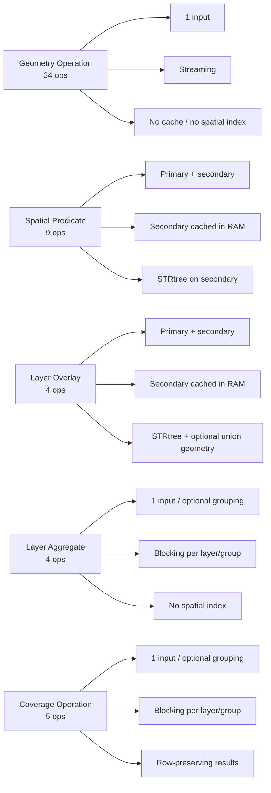

# Plugin Documentation

This documentation is organized along two axes:

- `What does the transform do?`
- `How does the transform execute?`

Many transforms look similar on the surface but behave very differently with respect to blocking,
RAM, secondary inputs, and spatial index usage.

## Documentation Map

- [Execution Models](execution-models.md)
  - row-wise vs cached-secondary vs blocking
- [Reference Matrix](reference-matrix.md)
  - compact table of all families and operations
- [Performance & Memory](performance-memory.md)
  - what is buffered, what is indexed, and what can become expensive
- Families
  - [Geometry Operation](families/geometry-operation.md)
  - [Spatial Predicate](families/spatial-predicate.md)
  - [Layer Overlay](families/layer-overlay.md)
  - [Layer Aggregate](families/layer-aggregate.md)
  - [Coverage Operation](families/coverage-operation.md)
- [Recipes](recipes/README.md)

## Family Overview

| Family | Operations | Inputs | Execution | RAM profile | Spatial index |
| --- | ---: | --- | --- | --- | --- |
| Geometry Operation | 34 | 1 layer | Streaming | current row only | no |
| Spatial Predicate | 9 | primary + secondary | Caches secondary layer | full secondary layer in memory | STRtree on secondary |
| Layer Overlay | 4 | primary + secondary | Blocking per layer | full secondary layer in memory | STRtree on secondary |
| Layer Aggregate | 4 | 1 layer, optional grouping | Blocking per layer/group | all rows in layer/group | no |
| Coverage Operation | 5 | 1 layer, optional grouping | Blocking per layer/group | all rows in layer/group | no |

## Visual Map

