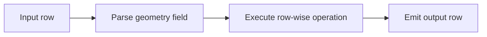
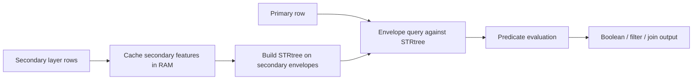
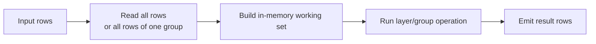

# Execution Models

The plugin has three distinct execution models. Understanding them is more important than memorizing
individual function names.

## Summary Table

| Transform family | Execution mode | Needs whole layer? | Needs second layer? | What stays in RAM? | Spatial index |
| --- | --- | --- | --- | --- | --- |
| Geometry Operation | Streaming | no | no | current row only | no |
| Spatial Predicate | Caches secondary layer | primary: no, secondary: yes | yes | full secondary layer | STRtree on secondary |
| Layer Overlay | Blocking per layer | effectively yes | yes | full secondary layer, optional union geometry | STRtree on secondary |
| Layer Aggregate | Blocking per layer/group | yes | no | all rows in layer or group | no |
| Coverage Operation | Blocking per layer/group | yes | no | all rows in layer or group | no |

## 1. Streaming Row

Used by `Geometry Operation`.

Characteristics:

- no layer-wide buffering
- no secondary input required
- no spatial index
- output can be emitted immediately after the current row is processed

## 2. Cached Secondary Layer

Used by `Spatial Predicate`.

Characteristics:

- the secondary layer is read and cached before primary rows are processed
- spatial index limits candidate checks
- primary input is still processed row-by-row after initialization
- first output appears only after the secondary cache and STRtree are ready

## 3. Blocking Per Layer or Group

Used by `Layer Overlay`, `Layer Aggregate`, and `Coverage Operation`.

Characteristics:

- first output row appears only after the needed working set is complete
- memory usage grows with layer size or group size
- required for overlay assembly, grouping, and coverage-wide topology operations

## Operational Consequences

- `Geometry Operation` has the lowest incremental memory growth because it processes one row at a
  time.
- `Spatial Predicate` delays primary-row output until the secondary layer has been cached and
  indexed.
- `Layer Overlay`, `Layer Aggregate`, and `Coverage Operation` delay output until their working set
  is complete.
- Large secondary layers or very large groups are the main memory hotspots in this plugin.
