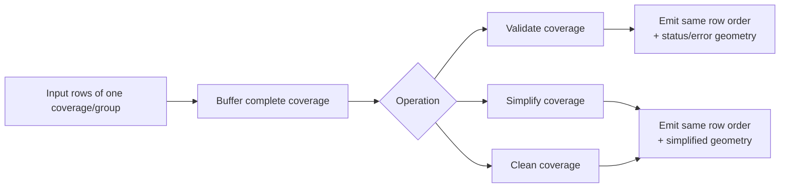

# Coverage Operation

`Coverage Operation` is the coverage-wide toolbox for polygon coverages. It validates, cleans, and
topology-preservingly simplifies while keeping row cardinality stable.

## At a Glance

| Field | Value |
| --- | --- |
| Purpose | Validate, clean, and simplify polygon coverages |
| Required Inputs | 1 layer, optional `groupFieldNames` |
| Execution Mode | blocking |
| Needs Whole Layer? | yes, at least the full active coverage group |
| Needs Second Layer? | no |
| What Stays in RAM? | all rows of the active coverage group |
| Spatial Index | no |
| Output Behavior | `1:1`, row-preserving |

## Diagram

## Operations in This Family

- `coverage_validate`
- `coverage_simplify`
- `coverage_simplify_inner`
- `coverage_simplify_outer`
- `coverage_clean`

Full list: [Reference Matrix](../reference-matrix.md#coverage-operation)

## Important Parameters

- `primaryGeometryField`
  - polygon geometry field used to build the coverage
- `groupFieldNames`
  - optional grouping fields; each group is processed as a separate coverage
- operation-specific tolerance parameters
  - simplification, validation, and cleaning use different distance and gap-related settings
- output-field parameters
  - validation appends status and error fields; simplify and clean return row-preserving geometry output

## Common Pitfalls

- Coverage operations require polygon geometries and full coverage context.
- They are blocking even though the result remains `1:1` and row-preserving.
- `coverage_validate` appends validation-status and error-geometry fields.
- `coverage_simplify*` preserves topology across the full coverage, which is different from
  row-wise `simplify_topology`.

## Related Recipes

- [Coverage Validate, Clean, Simplify, and Union](../recipes/coverage-workflow.md)
- [Group Aggregation / Dissolve](../recipes/group-aggregation.md)
