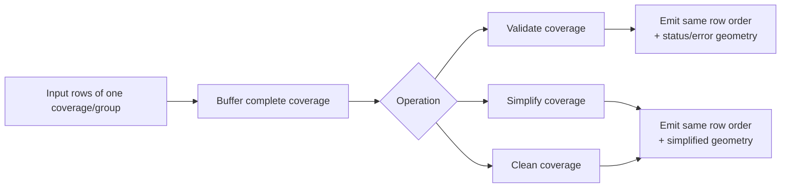

# Coverage Operation

`Coverage Operation` is the coverage-wide toolbox for polygon coverages. It validates, cleans, and
topology-preservingly simplifies while keeping row cardinality stable.

## At a Glance

| Field | Value |
| --- | --- |
| Purpose | Validate, clean, and simplify polygon coverages |
| Required Inputs | 1 layer, optional `groupFieldNames` |
| Execution Mode | blocking |
| Needs Whole Layer? | yes, at least the full active coverage group |
| Needs Second Layer? | no |
| What Stays in RAM? | all rows of the active coverage group |
| Spatial Index | no |
| Output Behavior | `1:1`, row-preserving |

## Diagram

## Operations in This Family

- `coverage_linearize` — shared circular boundary subdivision with optional target XY grid
- `coverage_validate`
- `coverage_simplify`
- `coverage_simplify_inner`
- `coverage_simplify_outer`
- `coverage_clean`

Full list: [Reference Matrix](../reference-matrix.md#coverage-operation)

## Important Parameters

- `primaryGeometryField`
  - polygon geometry field used to build the coverage
- `groupFieldNames`
  - optional grouping fields; each group is processed as a separate coverage
- operation-specific tolerance parameters
  - simplification, validation, and cleaning use different distance and gap-related settings
  - `coverage_validate` can optionally disallow all true coverage holes, independent of `gapWidth`
- output-field parameters
  - validation appends status and error fields; simplify and clean return row-preserving geometry output
- optional reject target hop
  - `coverage_validate` can also duplicate invalid rows to a second QA/reject output stream

## Validate Output Streams

When the selected operation is `coverage_validate`, the transform keeps the main output
row-preserving and appends validation result fields. By default these fields are
`coverage_is_valid`, `coverage_error`, and `coverage_error_type`, and all three names are
configurable.

| Stream | Rows included | Fields | Empty when |
| --- | --- | --- | --- |
| Main output | All input rows, in original row order | All input fields plus the validation boolean field, the error geometry field, and the error type field | Only when the transform receives no input rows |
| Reject target | Only rows whose validation boolean is `false` | The same row structure as the main output | No invalid rows were found, no reject target is connected, or the selected operation is not `coverage_validate` |

Validation result semantics:

- With the default field names, valid rows are emitted on the main output with
  `coverage_is_valid = true`, `coverage_error = null`, and `coverage_error_type = null`.
- With the default field names, invalid rows are emitted on the main output with
  `coverage_is_valid = false`, `coverage_error = <error geometry>`, and
  `coverage_error_type = <error code>`.
- `Gap width` detects only narrow gaps up to the configured maximum width.
- `Disallow coverage holes` is stricter: every interior hole in the full coverage union is invalid,
  regardless of size. Disjoint coverage islands are still allowed.
- Error-type codes are stable: `COVERAGE_INVALID`, `FORBIDDEN_HOLE`, and `MULTIPLE`.
- If both a base coverage error and a forbidden-hole error affect the same polygon, the transform
  combines both error geometries into `coverage_error` and emits `coverage_error_type = MULTIPLE`.
- `FORBIDDEN_HOLE` and `MULTIPLE` are emitted only when hole-specific validation can be computed
  from the full coverage union.
- If the coverage already has base topology errors and hole-specific validation cannot be computed,
  affected rows may still return only `COVERAGE_INVALID`, even when true holes are present in the
  same coverage.
- Hole-related error types are row-local: only polygons whose boundary touches the forbidden hole
  can return `FORBIDDEN_HOLE` or `MULTIPLE`. Other polygons in the same coverage can still return
  `COVERAGE_INVALID` or another row-specific result.
- If a reject target hop is configured, invalid rows are duplicated to that target. They are not
  removed from the main output.
- If no coverage errors are found, the reject target remains empty.

## Common Pitfalls

- Coverage operations require polygon geometries and full coverage context.
- They are blocking even though the result remains `1:1` and row-preserving.
- `coverage_validate` appends validation-status, error-geometry, and error-type fields.
- `Gap width` is not a strict no-hole rule; use `Disallow coverage holes` if the coverage must not
  contain any true interior holes.
- A visible hole does not guarantee `FORBIDDEN_HOLE` or `MULTIPLE`; when the coverage is already
  invalid, a row may still show only `COVERAGE_INVALID`.
- `FORBIDDEN_HOLE` and `MULTIPLE` are row-local classifications, not whole-coverage flags.
- The reject target stream only applies to `coverage_validate`; simplify and clean stay single-stream.
- `coverage_simplify*` preserves topology across the full coverage, which is different from
  row-wise `simplify_topology`.

## Related Recipes

- [Coverage Validate, Clean, Simplify, and Union](../recipes/coverage-workflow.md)
- [Group Aggregation / Dissolve](../recipes/group-aggregation.md)

## Circular boundaries

For `coverage_linearize`, `distanceValue` is the maximum XY chord deviation (sagitta).
`targetXyResolution`, `targetXOrigin` and `targetYOrigin` are optional together and must match the
writer's grid when exporting a coverage. Opposite directions and different subdivisions of an
exact shared circle receive common chords. Invalid output, ambiguous near-coincident circles and
coarse grids fail the group; there is no snapping, repair or automatic refinement.
See the [curve contract and limits](../../README.md#explicit-curve-linearization).
