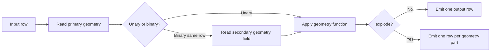

# Geometry Operation

`Geometry Operation` is the row-wise workhorse of the plugin.

## At a Glance

| Field | Value |
| --- | --- |
| Purpose | Modify or derive geometry on the same row, or combine it with a second geometry field from the same row |
| Required Inputs | 1 layer |
| Execution Mode | row-wise |
| Needs Whole Layer? | no |
| Needs Second Layer? | no |
| What Stays in RAM? | current row only |
| Spatial Index | no |
| Output Behavior | usually `1:1`; `explode` is `1:n` |

## Diagram

## Operations in This Family

- constructive operations such as `buffer`, `convex_hull`, and `concave_hull`
- edit operations such as `simplify`, `snap`, `fix_geometry`, and `reduce_precision`
- conversions such as `to_2d`, `to_multi`, and `extract_coordinates`
- measurement and helper geometries such as `centroid`, `envelope`, and `minimum_bounding_rectangle`
- same-row overlay operations such as `intersection`, `difference`, and `union`

Full list: [Reference Matrix](../reference-matrix.md#geometry-operation)

## Important Parameters

- `primaryGeometryField`
  - required for all operations
- `secondaryGeometryField`
  - used only for binary same-row operations such as `intersection`, `snap`, and `split`
- `distance`
  - distance, tolerance, or threshold depending on the operation
- `outputMode`
  - `APPEND` or `REPLACE`

## Common Pitfalls

- Binary operations in `Geometry Operation` do not use a second layer; they use a second geometry
  field from the same row.
- `explode` is the exception to the normal `1:1` output pattern.
- `simplify_topology` preserves topology within a single geometry, not across a polygon coverage.

## Related Recipes

- [Row-wise Geometry Editing](../recipes/row-wise-geometry-editing.md)
- [Overlay Two Layers](../recipes/layer-overlay.md)
