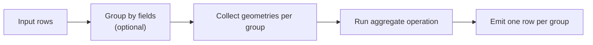

# Layer Aggregate

`Layer Aggregate` computes one geometry result per whole layer or per group.

## At a Glance

| Field | Value |
| --- | --- |
| Purpose | Aggregate geometries per whole layer or per group |
| Required Inputs | 1 layer, optional `groupFieldNames` |
| Execution Mode | blocking |
| Needs Whole Layer? | yes, at least the full active group |
| Needs Second Layer? | no |
| What Stays in RAM? | all rows of the active group |
| Spatial Index | no |
| Output Behavior | 1 row per group |

## Diagram

## Operations in This Family

- `dissolve`
- `unary_union`
- `coverage_union`
- `collect`

Full list: [Reference Matrix](../reference-matrix.md#layer-aggregate)

## Important Parameters

- `primaryGeometryField`
  - geometry field to aggregate
- `groupFieldNames`
  - optional grouping fields; without them the full layer becomes one working set
- `operation`
  - one of `dissolve`, `unary_union`, `coverage_union`, or `collect`

## Common Pitfalls

- Memory demand is driven by the largest group.
- Without grouping fields, the full layer becomes one working set.
- `coverage_union` requires polygon coverages with valid shared boundaries.

## Related Recipes

- [Group Aggregation / Dissolve](../recipes/group-aggregation.md)
- [Coverage Validate, Clean, Simplify, and Union](../recipes/coverage-workflow.md)
