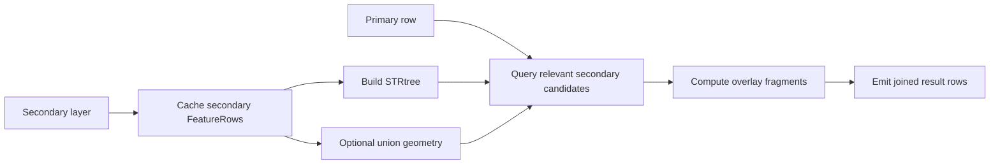

# Layer Overlay

`Layer Overlay` creates new overlay geometries from a primary layer and a cached secondary layer.

## At a Glance

| Field | Value |
| --- | --- |
| Purpose | Create overlay geometries and combine attributes from both inputs |
| Required Inputs | primary input + secondary info stream |
| Execution Mode | blocking |
| Needs Whole Layer? | the secondary layer is cached completely before primary processing continues |
| Needs Second Layer? | yes |
| What Stays in RAM? | secondary FeatureRows, STRtree, and optional union geometry |
| Spatial Index | yes, STRtree on the secondary layer |
| Output Behavior | `0:n` overlay fragments |

## Diagram

## Operations in This Family

- `intersection`
- `clip`
- `erase`
- `identity`

Full list: [Reference Matrix](../reference-matrix.md#layer-overlay)

## Important Parameters

- `primaryGeometryField`
  - geometry field from the primary input
- `secondaryGeometryField`
  - geometry field from the secondary info stream
- `operation`
  - one of `intersection`, `clip`, `erase`, or `identity`

## Common Pitfalls

- `Layer Overlay` produces new geometries, not only match/no-match results.
- The secondary layer is cached completely even if only part of it contributes to the final result.
- Complex polygons and heavy fragmentation drive runtime and memory more strongly than feature
  count alone.

## Related Recipes

- [Overlay Two Layers](../recipes/layer-overlay.md)
- [Coverage Validate, Clean, Simplify, and Union](../recipes/coverage-workflow.md)
