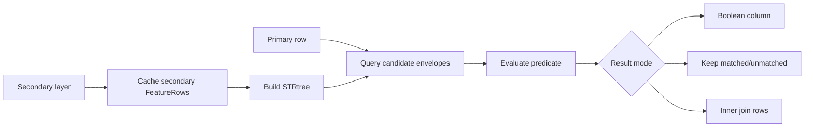

# Spatial Predicate

`Spatial Predicate` compares a primary row against a cached secondary layer and returns either a
boolean, a filter decision, or an inner join.

## At a Glance

| Field | Value |
| --- | --- |
| Purpose | Evaluate primary features against a secondary layer |
| Required Inputs | primary input + secondary info stream |
| Execution Mode | cached-secondary |
| Needs Whole Layer? | secondary layer only |
| Needs Second Layer? | yes |
| What Stays in RAM? | full secondary layer |
| Spatial Index | yes, STRtree on the secondary layer |
| Output Behavior | boolean column, filter, or `0:n` inner join |

## Diagram

## Operations in This Family

- topological predicates: `intersects`, `contains`, `within`, `touches`, `crosses`, `overlaps`,
  `disjoint`
- distance predicates: `distance_lte`, `distance_gte`

Full list: [Reference Matrix](../reference-matrix.md#spatial-predicate)

## Important Parameters

- `primaryGeometryField`
  - geometry field from the primary input
- `secondaryGeometryField`
  - geometry field from the secondary info stream
- `resultMode`
  - controls whether the output is a boolean column, a filter, or an inner join
- `distance`
  - threshold for `distance_lte` and `distance_gte`
- `BOOLEAN_COLUMN`
  - writes `true/false` to a new column
- `KEEP_MATCHED`
  - keeps matched primary rows
- `KEEP_UNMATCHED`
  - keeps unmatched primary rows
- `INNER_JOIN`
  - one primary row can produce multiple output rows

## Common Pitfalls

- The secondary layer is fully read before the first primary row is processed.
- `INNER_JOIN` is not supported for `disjoint` or `distance_gte`.
- The spatial index reduces the candidate set, but full geometry evaluation is still required.

## Related Recipes

- [Point-in-Polygon Join](../recipes/point-in-polygon-join.md)
- [Overlay Two Layers](../recipes/layer-overlay.md)
