# Performance & Memory

This page explains where the plugin holds data in memory, where spatial indexing is used, and what
that means for large datasets.

## Memory and Index Summary

| Family | Main memory consumer | Spatial index | Practical risk |
| --- | --- | --- | --- |
| Geometry Operation | current row only | no | low |
| Spatial Predicate | full secondary layer | STRtree on secondary | medium to high if secondary is large |
| Layer Overlay | full secondary layer, optional union geometry | STRtree on secondary | high for large or complex secondary layers |
| Layer Aggregate | all rows of the active layer/group | no | high for large groups |
| Coverage Operation | all rows of the active layer/group | no | high for large groups or large polygon coverages |

## Where RAM Goes

```mermaid
flowchart TD
  A["Geometry Operation"] --> A1["Current row only"]
  B["Spatial Predicate"] --> B1["Secondary FeatureRow list"]
  B --> B2["Secondary row metadata clone"]
  B --> B3["STRtree on secondary envelopes"]
  C["Layer Overlay"] --> C1["Secondary FeatureRow list"]
  C --> C2["STRtree on secondary envelopes"]
  C --> C3["Optional union geometry of secondary layer"]
  D["Layer Aggregate"] --> D1["All rows of a layer or group"]
  D --> D2["Grouped geometries before emission"]
  E["Coverage Operation"] --> E1["All rows of a layer or group"]
  E --> E2["Coverage-wide validation or simplification state"]
```

## Where Spatial Index Helps

Spatial indexing is currently used only for the two-family pattern `primary input + secondary layer`.

| Family | Why index helps |
| --- | --- |
| Spatial Predicate | prunes the secondary candidate set before expensive predicate checks |
| Layer Overlay | prunes the secondary candidate set before overlay fragment generation |

Important:

- `Layer Aggregate` does not use a spatial index because it is not querying another layer.
- `Coverage Operation` does not use a spatial index because it needs full coverage context, not
  row-wise candidate lookup.
- `Geometry Operation` does not use a spatial index because it operates on one row at a time.

## Detailed Notes by Family

## Geometry Operation

- execution is truly streaming
- almost no incremental memory growth with dataset size
- memory is bounded mainly by the current row and the current operation state

## Spatial Predicate

- the secondary layer is read completely before primary processing starts
- cached data includes geometries, row data, envelopes, SRIDs, and the STRtree
- if memory is tight, reduce the secondary layer earlier in the pipeline

## Layer Overlay

- also reads the secondary layer completely
- in addition to the STRtree it may build a union geometry for optimization
- polygon complexity matters, not just feature count
- large overlay inputs are the most expensive part of the plugin family set

## Layer Aggregate

- buffers rows until the layer or active group is complete
- memory depends on largest group, not only on total row count
- grouping can reduce or increase pressure depending on data distribution

## Coverage Operation

- buffers the full layer or the current group before emitting any result
- coverage algorithms need full polygon context, so blocking is expected
- row order is preserved on output, but only after the whole working set is processed

## Planning Factors

- row-wise execution keeps memory flatter than layer-wide or group-wide execution
- `Spatial Predicate` and `Layer Overlay` scale with the size and geometry complexity of the
  secondary layer
- `Layer Aggregate` and `Coverage Operation` scale with the size of the active group or full layer
- geometry complexity affects overlay and coverage costs more strongly than feature count alone
- realistic test data should include representative polygon complexity, overlap density, and group
  size
