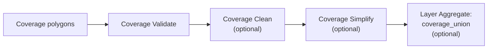

# Recipe: Coverage Validate, Clean, Simplify, and Union

## Goal

Process a polygon coverage safely, keep row identity during QA and cleaning, and optionally produce
a group-wide final union.

## Pipeline Sketch

## Example Sequence

1. `coverage_validate`
   - find overlaps, mismatched edges, or narrow gaps
   - enable `Disallow coverage holes` if the coverage must not contain any true interior holes
2. `coverage_clean`
   - snap and merge small discrepancies where needed
3. `coverage_simplify`, `coverage_simplify_inner`, or `coverage_simplify_outer`
   - simplify while preserving coverage topology
4. `coverage_union`
   - aggregate to one geometry per layer or group if required

## Inspecting Validation Results

If you inspect `Coverage Validate` with the Geometry Inspector:

- `Geometry source = Output` shows the transform's main output rows, not the optional reject target
  stream.
- In practice, `Auto` also stays on output for `Coverage Validate`, because the transform emits a
  main output row for every input row.
- Select the original coverage geometry field when you want to inspect the validated coverage
  geometries in row-preserving order.
- Select the validation error geometry field when you want to visualize reported coverage problems.
  Rows without an error keep a `null` error geometry and therefore do not render an error feature.
- Use the validation error type field when you need to distinguish `COVERAGE_INVALID`,
  `FORBIDDEN_HOLE`, and `MULTIPLE` in downstream QA or routing steps.
- If `Disallow coverage holes` is enabled, polygons bordering a forbidden coverage hole are marked
  invalid and their shared hole boundary appears in the error geometry field with
  `coverage_error_type = FORBIDDEN_HOLE`.
- `FORBIDDEN_HOLE` means the current row borders a forbidden hole and the hole-specific check
  succeeded for the current coverage group.
- A row can still show only `COVERAGE_INVALID` although the overall coverage contains holes, if
  another coverage error prevents hole-specific classification.
- Therefore, `coverage_error_type = COVERAGE_INVALID` does not prove that no forbidden hole exists
  elsewhere in the same coverage group.
- If you want to inspect only rejected invalid rows, inspect the downstream reject target transform
  or a transform connected to that reject hop.

## Constraints and Caveats

- all coverage operations are blocking
- inputs must be polygonal
- very large coverage groups can be memory-intensive
- `coverage_union` belongs to `Layer Aggregate`, not to `Coverage Operation`
