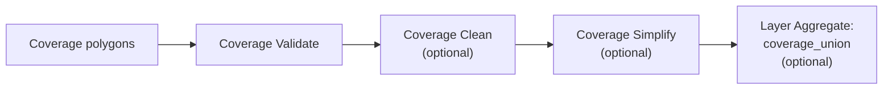

# Recipe: Coverage Validate, Clean, Simplify, and Union

## Goal

Process a polygon coverage safely, keep row identity during QA and cleaning, and optionally produce
a group-wide final union.

## Pipeline Sketch

## Example Sequence

1. `coverage_validate`
   - find overlaps, mismatched edges, or narrow gaps
2. `coverage_clean`
   - snap and merge small discrepancies where needed
3. `coverage_simplify`, `coverage_simplify_inner`, or `coverage_simplify_outer`
   - simplify while preserving coverage topology
4. `coverage_union`
   - aggregate to one geometry per layer or group if required

## Constraints and Caveats

- all coverage operations are blocking
- inputs must be polygonal
- very large coverage groups can be memory-intensive
- `coverage_union` belongs to `Layer Aggregate`, not to `Coverage Operation`
