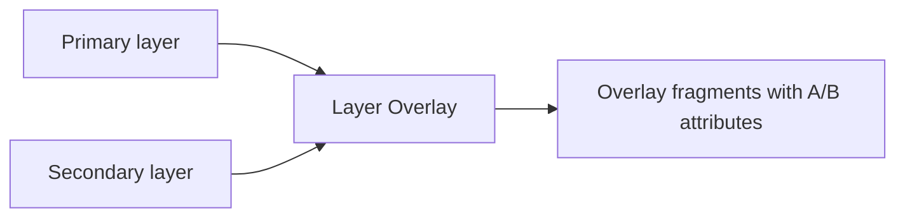

# Recipe: Overlay Two Layers

## Goal

Create new overlay geometries from two layers and keep attributes from both sides.

Examples:

- clip parcels by municipality
- erase forbidden zones from a planning layer
- compute intersections between parcels and land-use polygons

## Pipeline Sketch

## Operation Variants in This Example

- `clip`
  - keep only the portion of the primary layer inside the secondary layer
- `erase`
  - remove parts of the primary layer covered by the secondary layer
- `intersection`
  - keep only overlapping fragments from both layers
- `identity`
  - preserve primary coverage while adding overlay attributes where relevant

## Constraints and Caveats

- large or complex secondary polygons can be expensive
- output cardinality is often `0:n`
- the secondary layer is cached before the first output row is emitted
