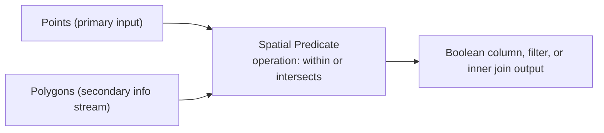

# Recipe: Point-in-Polygon Join

## Goal

Attach polygon attributes to points, or filter points by whether they fall into polygons.

## Pipeline Sketch

## Operation Variants in This Example

- `within` + `INNER_JOIN`
  - add polygon attributes to each point
- `within` + `BOOLEAN_COLUMN`
  - mark whether a point lies inside any polygon
- `intersects` + `KEEP_MATCHED`
  - keep only points that hit a polygon

## Constraints and Caveats

- the polygon layer must fit in memory
- `INNER_JOIN` can produce multiple rows per point if polygons overlap
- the primary and secondary geometry fields must be configured explicitly
